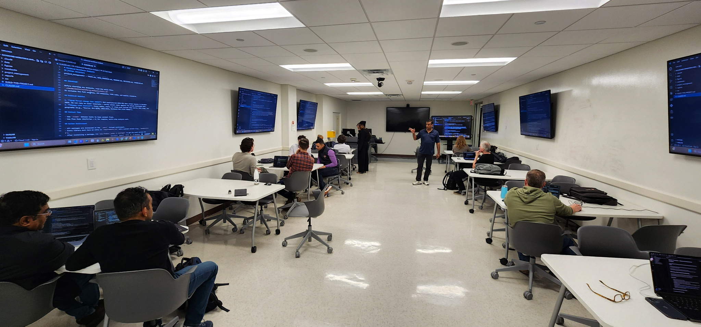

# Vibe Coding for Professionals

**Building Repeatable AI Workflows with Claude Code**

Workshop materials from the [AI Ready RVA](https://aireadyrva.com) session at VCU School of Pharmacy, Laboratory of Digital Health — March 14, 2026.

## Why This Matters

Most AI workshops teach you how to write prompts. This one teaches you how to build **persistent, structured AI workflows** that survive across sessions.

The core idea: treat AI like a new team member. Write it onboarding documents — a project memory file, a standard operating procedure, a job description, compliance guardrails — and it shows up ready to work every time you open the project. No re-explaining context. No copy-pasting prompts. Just structured collaboration that compounds over time.

This matters for professionals across every domain — healthcare, finance, government, consulting, defense — because the same pattern works whether you're analyzing workforce data, mapping grant funding, or profiling community health. Every workflow includes built-in guardrails for data ethics, source attribution, and responsible interpretation.

## Start Here (Brand New to Coding?)

If you've never used a terminal before, follow these five steps:

1. **Download this repo** — click the green **Code** button above, then **Download ZIP**, and unzip it
2. **Install [VS Code](https://code.visualstudio.com/)** and **[Claude Code](https://docs.anthropic.com/en/docs/claude-code/overview)** (requires an Anthropic API key or Claude Pro/Max subscription)
3. **Open one starter project folder** in VS Code (e.g., `03-starter-projects/richmond-workforce-analysis/`)
4. **Open the terminal** (Ctrl+`` ` ``), type `claude`, and **paste the entire contents of `BUILD-THIS-PROJECT.md`**
5. **Wait ~15 minutes** for Claude to generate your project, then **restart Claude Code** so it loads the new CLAUDE.md — compare your output to `04-completed-examples/` to verify it worked

That's it. One paste, one restart, one working AI workflow.

## Quick Start (For Developers)

1. **Install Claude Code**: `winget install Anthropic.ClaudeCode` (Windows) or `brew install claude-code` (macOS)
2. **Pick a starter project** from `03-starter-projects/` and open the folder in VS Code
3. **Start Claude Code** — open the terminal and type `claude`
4. **Copy the contents of `BUILD-THIS-PROJECT.md`** and paste it into Claude Code
5. **Restart Claude Code** after generation so it loads the new CLAUDE.md

## Repository Contents

| Directory | What's Inside | How to Use |
|-----------|--------------|------------|
| `01-workshop-handouts/full-templates/` | Full v2.2 templates (~500-600 lines, ~28 files each) | Take-home for deeper projects |
| `01-workshop-handouts/workshop-guide/` | Complete workshop reference guide (.md, .docx, .pdf) | Comprehensive walkthrough of Claude Code project architecture |
| `02-presentation/` | Opening presentation slides | 30-minute overview of the workflow harness concept |
| `03-starter-projects/` | 3 standalone project folders, each with a `BUILD-THIS-PROJECT.md` template | Pick one, open in VS Code, paste template into Claude Code |
| `04-completed-examples/` | What each project looks like after Claude builds it (CLAUDE.md, skill, agent, rule) | Compare your output or use as a fallback |

## The Three Use Cases

| Use Case | Data Source | Agent | What It Builds |
|----------|-----------|-------|----------------|
| Richmond Workforce Analysis | BLS QCEW API | research-analyst | Employment trends, industry growth charts |
| Grant Funding Landscape | NIH Reporter API | grant-writer | Funding analysis, strategic positioning for investigators |
| Public Health Snapshot | CDC PLACES + Census ACS | clinical-reviewer | Community health profile, composite health index |

All three use the same 5-file harness pattern. Different data, different agents — same architecture.

## The 5-File Harness

Every starter template generates exactly 5 things:

| File | Purpose | Analogy |
|------|---------|---------|
| `CLAUDE.md` | Project memory — auto-loaded every session | Onboarding doc for a new team member |
| `.claude/skills/*/SKILL.md` | Step-by-step workflow | Standard Operating Procedure |
| `.claude/agents/*.md` | Specialist persona with expertise and constraints | Job description + scope of practice |
| `.claude/rules/*.md` | Guardrails the AI cannot break | Compliance requirements |
| Folder structure | Where data, outputs, and code live | Filing system |

> "Think of it as writing onboarding documents for an AI team member — once written, they persist across every session." — Anthropic, Claude Code Documentation

## Prerequisites

- [VS Code](https://code.visualstudio.com/)
- [Claude Code](https://docs.anthropic.com/en/docs/claude-code/overview) — requires Anthropic API key or Claude Pro/Max subscription
- Google Account (optional — for Google Drive junction and Colab)

## Workshop Team

- **Dr. Dayanjan S. Wijesinghe** — AI Ready RVA, VCU School of Pharmacy, Laboratory of Digital Health
- **Ms. Mora Alabi, PharmD Candidate** — VCU School of Pharmacy

## Interested in a Workshop?

The Laboratory of Digital Health at VCU School of Pharmacy is always open to sharing knowledge, empowering communities, and helping workforces build practical AI skills. If your organization is interested in a similar hands-on session, [reach out](mailto:dswijesinghe@vcu.edu).

## Resources

- [Claude Code Documentation](https://docs.anthropic.com/en/docs/claude-code/overview)
- [Claude Code Skills](https://docs.anthropic.com/en/docs/claude-code/skills)
- [Claude Code Subagents](https://docs.anthropic.com/en/docs/claude-code/sub-agents)
- [BLS QCEW Open Data](https://www.bls.gov/cew/additional-resources/open-data/)
- [NIH Reporter API](https://api.reporter.nih.gov/)
- [CDC PLACES](https://www.cdc.gov/places/)

## License

© 2026 Dayanjan S. Wijesinghe. Licensed under [CC BY-NC 4.0](https://creativecommons.org/licenses/by-nc/4.0/).

You are free to share and adapt these materials for non-commercial purposes with attribution.
